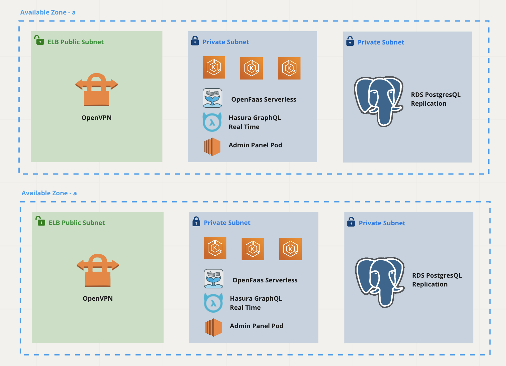

# Hasura Backend

Hasura + OpenFaas Serverless functions for Hasura-Serverless System.



## Getting Started

First at all, please download and install [Docker Desktop](https://docs.docker.com/engine/install/) and enable [Kubernetes](https://andrewlock.net/running-kubernetes-and-the-dashboard-with-docker-desktop/) in preferences.

## Setup

We have two ways to setup and build the local environment, use `make command` and `manual setup`

Copy `.env.example` to `.env` at root directory and each function directory.

### Using Make command

Setup and build local environment:

> See how can generate a personal token here https://docs.github.com/en/github/authenticating-to-github/keeping-your-account-and-data-secure/creating-a-personal-access-token

```sh
# Export NPM_TOKEN or you should put it into your zshrc file
$ export NPM_TOKEN=<NPM_TOKEN>

$ echo -e "//npm.pkg.github.com/:_authToken=$NPM_TOKEN\n\
@halay08:registry=https://npm.pkg.github.com/" > ~/.npmrc

# Clear all docker images, this command might have the error
$ make stack/infra/purge
# Run setup
$ make setup
$ make stack/hasura/install
```

Start and leave your work
```sh
$ make work
$ make leave
```

Restart all functions
```
$ stack/functions/restart
```

Rebuild all functions
```
$ stack/functions/buildup
```

### Manual Setup

#### Installing the Hasura CLI

In your Terminal, run the following command:

```bash
curl -L https://github.com/hasura/graphql-engine/raw/stable/cli/get.sh | bash
```

#### Install OpenFaaS

- Get arkage

  ```
  # For MacOS / Linux:
  curl -SLsf https://dl.get-arkade.dev/ | sudo sh

  # For Windows (using Git Bash)
  curl -SLsf https://dl.get-arkade.dev/ | sh
  ```

- Install the OpenFaaS app

  ```sh
  $ arkade install openfaas
  ```

- Forward the gateway to your machine

  ```sh
  $ kubectl rollout status -n openfaas deploy/gateway
  $ kubectl port-forward -n openfaas svc/gateway 8090:8090 &
  ```

- If basic auth is enabled, you can now log into your gateway:
```sh
PASSWORD=$(kubectl get secret -n openfaas basic-auth -o jsonpath="{.data.basic-auth-password}" | base64 --decode; echo)
echo -n $PASSWORD | faas-cli login --username admin --password-stdin
```

#### Install OpenFaaS CLI

```bash
$ curl -sSL https://cli.openfaas.com | sh
```

#### Running development instance

Copy default environment variables:

```bash
cp .env.example .env
```

Run Harura and PostgreSQL by following command:

```bash
docker-compose up
```

### Development

**Creating new database migration**

```sh
$ cd hasura
$ hasura migrate create migration-name --up-sql "CREATE TABLE users(id serial NOT NULL, username varchar NOT NULL, email varchar NOT NULL, email_verified boolean DEFAULT false, phone_verified boolean DEFAULT false, status int NOT NULL DEFAULT 0);"  --down-sql "DROP TABLE users;"
```


Apply migration and seeder by running:

```sh
$ cd hasura
$ hasura migrate apply
$ hasura seeds apply
```

Add table to metadata/tables.yaml
```yaml
- table:
    schema: public
    name: users
```

Apply the metadata by running:

```
$ hasura metadata apply
```

**Hasura Console**

Open API explorer at `http://localhost:8090/console/api-explorer`. See the admin secret in the env file, key `HASURA_GRAPHQL_ADMIN_SECRET`

Run GraphQL query

```graphql
query {
  users {
    id
    email
  }
}
```

Creating new function

```
faas-cli new function_name --lang node-typescript
```

Install/uninstall new NPM package for all functions

```sh
# Uninstall
$ make node/uninstall/package p=<package_name>
# Install
$ make node/install/package p=<package_name>
```

### Makefile commands
```sh
Stack Targets:

  stack/infra/install # Install infrastructure
  stack/faas/install # Install only FAAS for infrastructure
  stack/infra/start # Start infrastructure
  stack/network/create # Creates the docker network (checks if it exists first).
  stack/network/recreate # Destroys and re-creates the docker network.
  stack/infra/up # Bring only the infrastructure containers UP
  stack/infra/down # Bring only the infrastructure containers DOWN (does not touch the module services).
  stack/infra/restart # Restart only the infrastructure containers.
  stack/all/buildrestart # Re-builds and re-starts ALL functions including infrastructure services.
  stack/infra/downdeletevolumes # Bring only the infrastructure containers DOWN (does not touch the module services) + DELETE data volumes.
  node/remove/all # Remove node_modules across all functions.
  node/install/all # Install node_modules across all functions.
  node/install/package # Install a specific node module with @latest (requires MODULE)
  stack/rollout/deployment # Rollout deployment
  stack/infra/portforward # add cloud connections
  stack/infra/login # Stores basic auth credentials for OpenFaaS gateway (supports multiple gateways)
  env/clone  # Clone env file
  stack/status # Displays the output of docker.

Function Targets:

  stack/functions/build           # Build all functions
  stack/functions/down            # Bring only the functions DOWN (not the main dependencies like postgres, elasticsearch, etc).
  stack/functions/up              # Bring only the functions UP (not the main dependencies like postgres, graphql-engine, etc).
  stack/functions/buildup         # Build and start all containers

Hasura Targets:

  stack/hasura/install            # Run migration, seeder and apply metadata
  stack/hasura/migrate            # Hasura run migration and seeding
  stack/hasura/metadata           # Hasura run migration and seeding
```

## Troubleshooting

If you're using Windows OS and can't setup using Linux commands, please try to use Linux portable inside the OS. See details below:

- Linux on Windows: https://www.youtube.com/watch?v=LLlfLpvQg04
- Terminal: https://www.microsoft.com/en-us/p/windows-terminal/9n0dx20hk701?activetab=pivot:overviewtab#

You might need to restart your local machine if some error occurs when first time setup.
